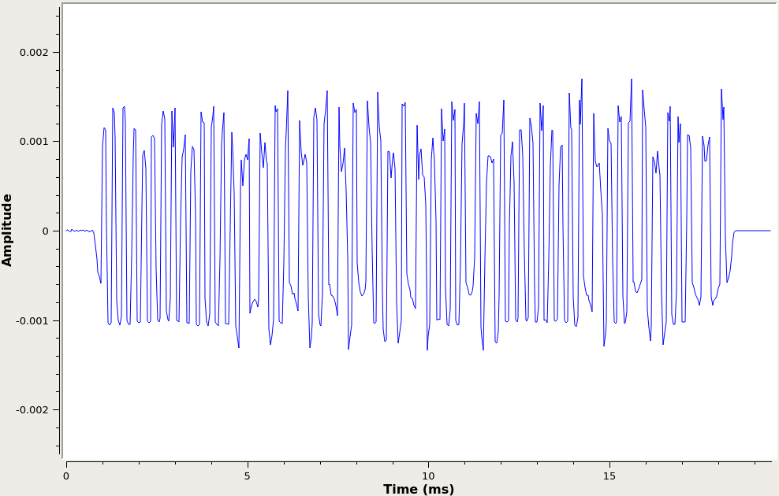
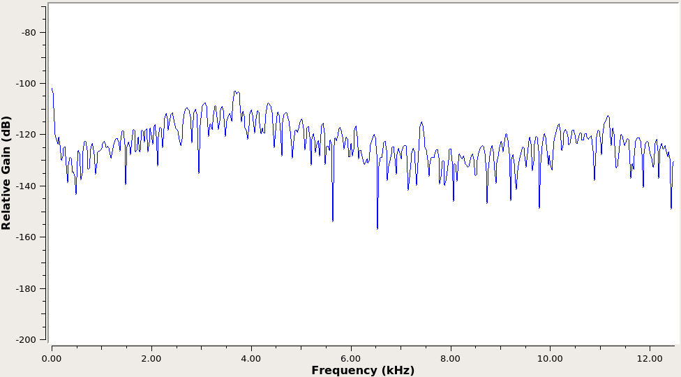

# Soapy345
A (WIP) 345 MHz sensor receiver based on the [SoapySDR](https://github.com/pothosware/SoapySDR) wrapper for the HackRF One. It is a rewrite of software I wrote previously in Python using GNU Radio.
Currently, baseline hardware functionality and signal processing functionality is working, but needs some adjustment. Messages are received and verified using the CRC. Messages are used to track sensor state and output readable status change sumamries.
Next up is to add the ability to process a prerecorded file of IQ samples so that the signal processing implementation can be quickly optimized for accuracy and efficiency with consistent input data quality.

## Install Dependencies:
apt install build-essential libsoapysdr-dev soapysdr-module-hackrf

# Signal Processing Overview
## 1. Raw Signal

## 2. Intermediate Frequency Signal

## 3. Baseband Signal

Note the lage DC offset due to using a digital diode detector (magnitude squared)

## 4. Filtered Baseband Signal (DC Remove)

With optimal DC offset applied to the signal, a square wave can easily be derived from the zero-crossings

## 5. Final Square Wave

Note that even the low-amplitude noise signal (at the left and right edges of this graphic) results in a square wave due to no threshold detection. This noise data is easily eliminated by comparing it with the expected sync sequence of a sensor transmission.
