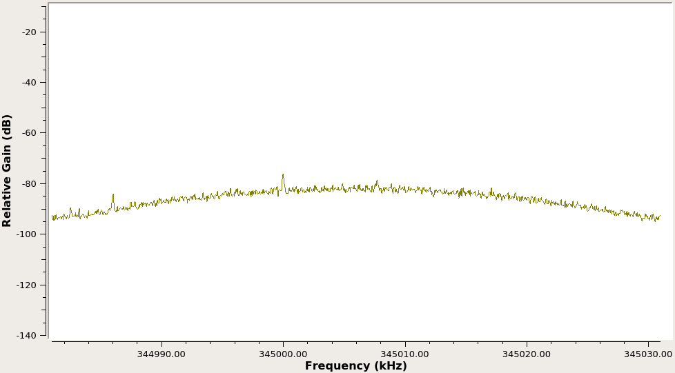

# Soapy345
A (WIP) 345 MHz sensor receiver based on the [SoapySDR](https://github.com/pothosware/SoapySDR) wrapper for the HackRF One. It is a rewrite of software I wrote previously in Python using GNU Radio.
Currently, baseline hardware functionality and signal processing functionality is working, but needs some adjustment. Messages are received and verified using the CRC. Messages are used to track sensor state and output readable status change sumamries.
Next up is to write a desctructor for the sensor tracker which outputs overall summary data for each sensor, and add the ability to process a prerecorded file of IQ samples so that the signal processing code can be benchmarked optimized for accuracy and efficiency.

## Install Dependencies:
apt install build-essential libsoapysdr-dev soapysdr-module-hackrf

## Filter Performance with Noise Input:
### Raw, Unfiltered Samples

### Intermediate Frequency Samples

## Filter Performance with Signal Input:
### Raw, Unfiltered Samples

### Intermediate Frequency Samples

