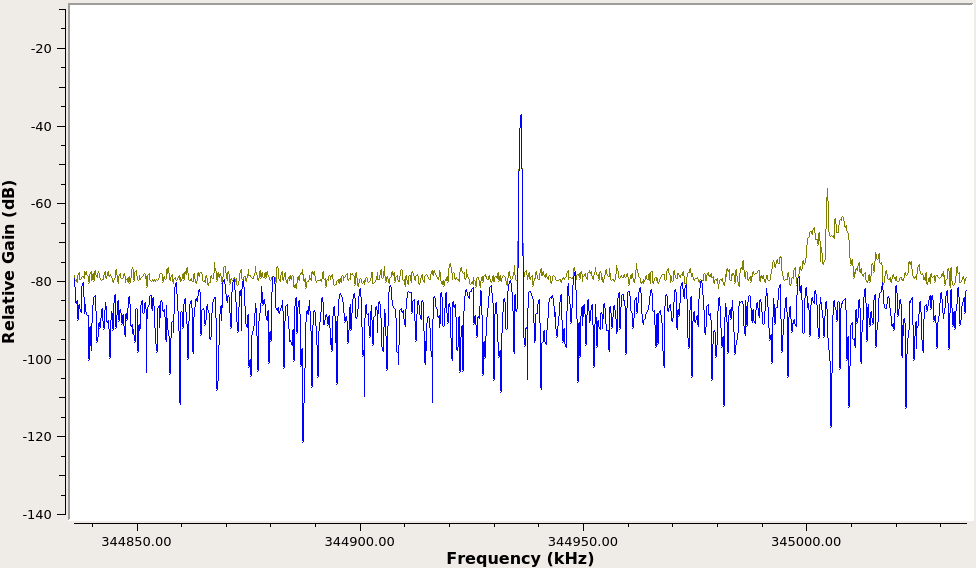
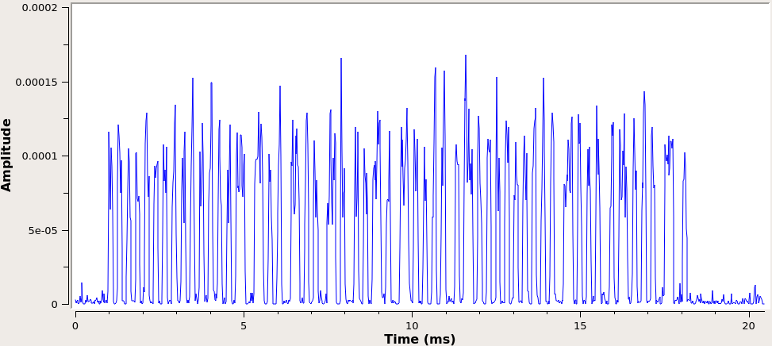
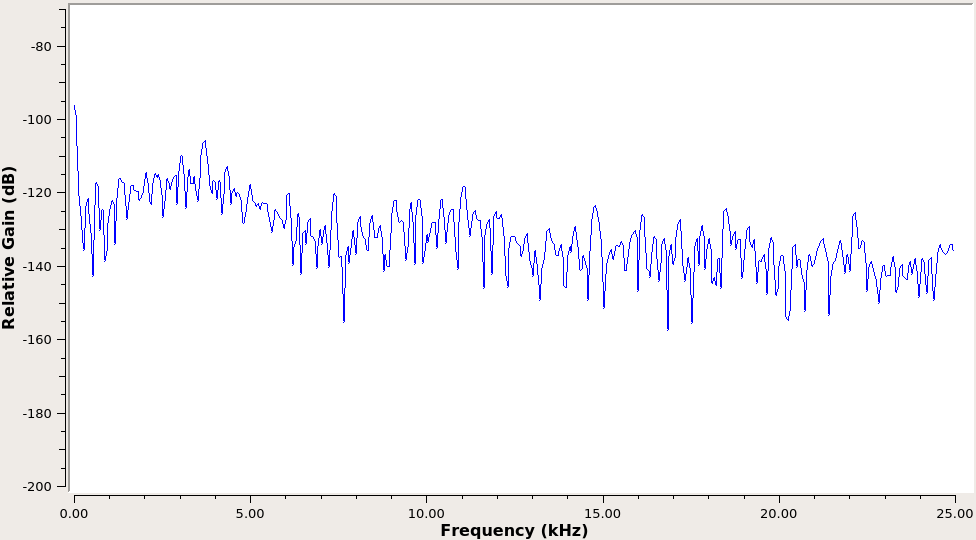

# Soapy345
A (WIP) 345 MHz sensor receiver based on the [SoapySDR](https://github.com/pothosware/SoapySDR) wrapper for the HackRF One. It is a rewrite of software I wrote previously in Python using GNU Radio.
Currently, baseline hardware functionality and signal processing functionality is working, but needs some adjustment. Messages are received and verified using the CRC. Messages are used to track sensor state and output readable status change sumamries.
 Binary CF32 input files can be passed in as a parameter instead of using a hardware SDR sample source.

## Compile, Install, and Execute:
1. apt install build-essential libsoapysdr-dev soapysdr-module-hackrf
1. git clone https://github.com/pblumel/Soapy345.git
1. cd Soapy345
1. make all
1. sudo make install
1. Soapy345 OR Soapy345 [INPUT FILE]

## Uninstall
1. Change directories (cd) into the local repository
1. sudo make uninstall

# Signal Processing Overview
## 1. Raw Signal

## 2. Intermediate Frequency Signal

## 3. Baseband Signal

Note the large DC offset due to using a digital diode detector (magnitude squared).

## 4. Baseband Signal with DC Remove Filtering

With optimal DC offset applied to the signal, a square wave can be derived from the zero-crossings. Note, however, that some high-frequency components may result in detected zero-crossings at undesireable locations in the signal. A lowpass filter can further improve signal integrity.

## 5. Baseband Signal with Lowpass Filtering

With high-frequency components filtered out, the signal is much more resilient against undesireable zero-crossings.

## 6. Final Square Wave

Note that even the low-amplitude noise signal results in a square wave due to no threshold detection, as seen at the left and right edges of the desireable transmission shown above. This noise data is easily eliminated by comparing it with the expected sync sequence and CRC value of a sensor transmission.
